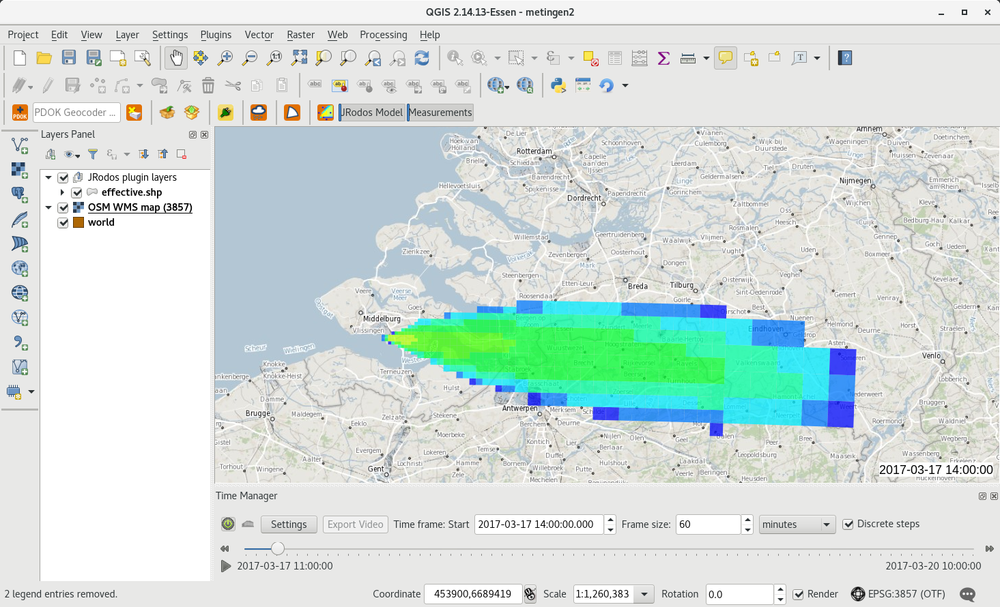
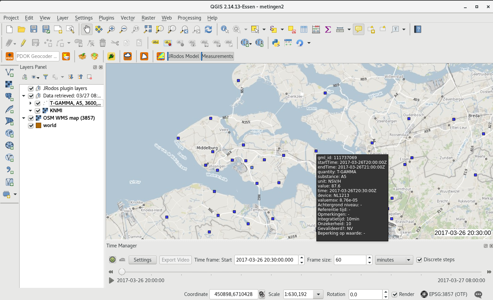
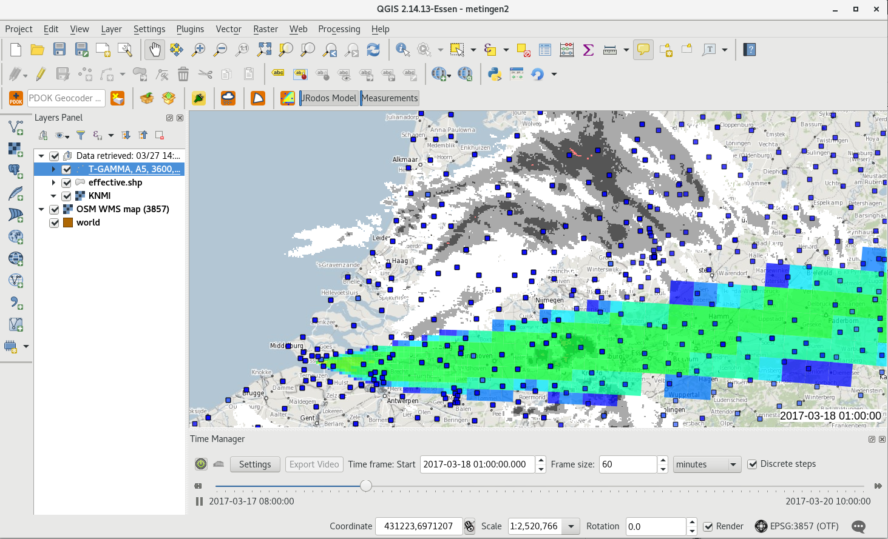
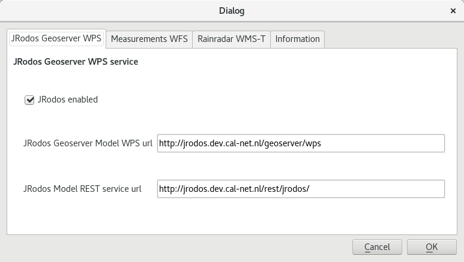
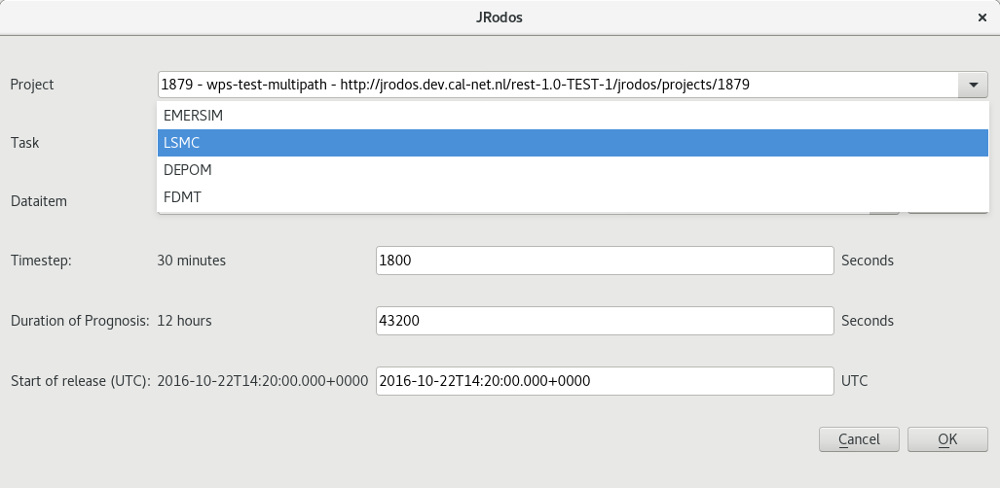
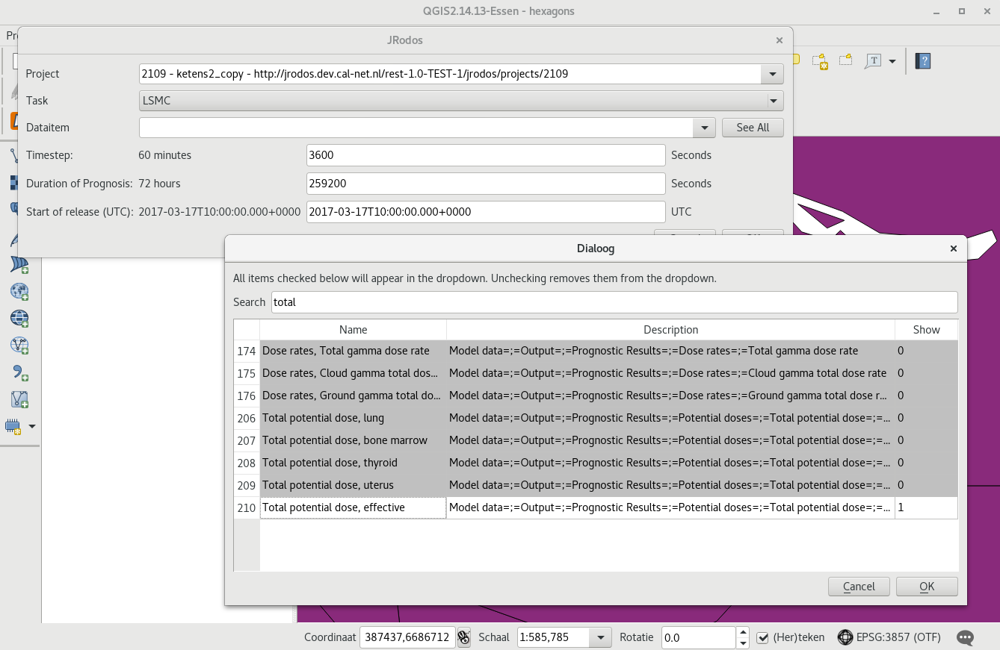
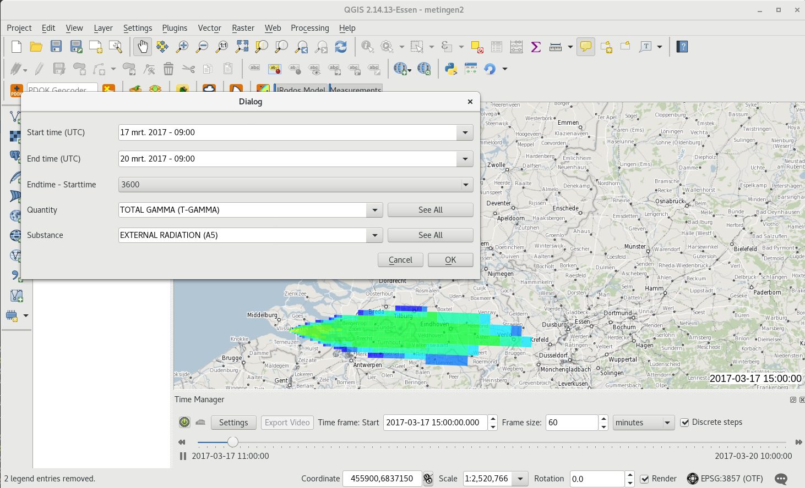
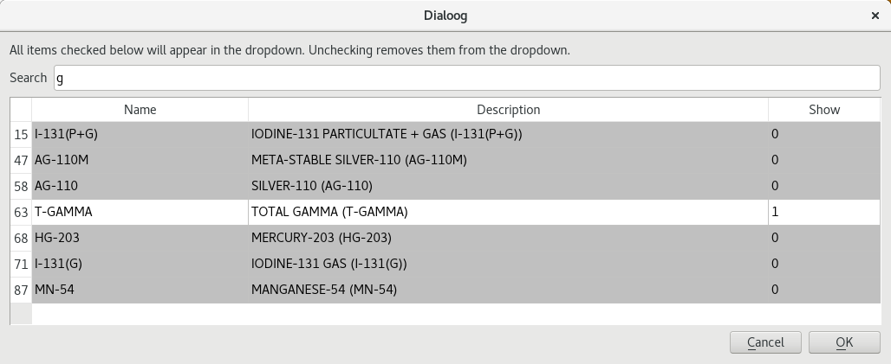
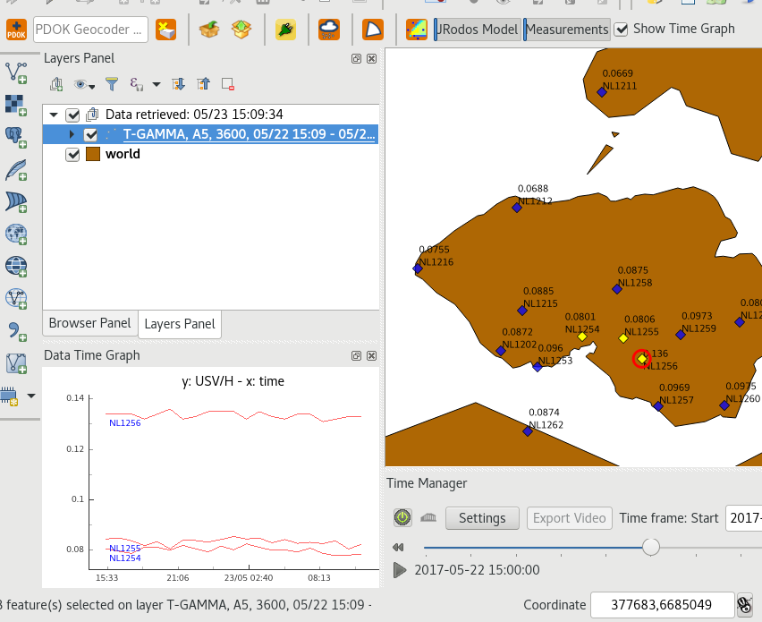
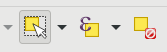

Documentation
=============

.. contents::
   :local:

What does it do
---------------

The JRodos plugin is a plugin to:

- view JRodos model outputs in QGIS (requested via Geoserver-JRodos WPS + REST interface for project information)
- view Measurements (requested via Measurements-WFS + SOAP interface for parameters) in QGIS
- load Rain/Weatherinformation from KNMI (WMS-Time service) at time of measurements
- check if TimeManager plugin is installed
- registers the 3 layers mentioned above in TimeManager plugin to be able to (re)'play' a time/model frame

QGIS showing JRodos model output

QGIS showing measurements with tooltip

QGIS showing model, measurements plus rain radar in the same model period

Make it work
------------

Install both(!!!) the JRodos plugin and the TimeManager plugin using QGIS Plugin Manager,
both from the RIVM plugin repository(!).

Make sure both plugins are active (and the TimeManager slider is visible below the map).

If you need some map data as background/reference layers, install 'QuickMapServices' plugin (to have world maps)
or 'PDOK Services Plugin' (for online NL maps) via the plugin manager of QGIS.
The RIVM WMS (WebMappingService) provides NL and world maps too,
even without external internet connection: http://geoserver.prd.cal-net.nl/geoserver/rivm/ows

How does it work
----------------

The plugin is an extensive user of online services

The http communication is done via 'Providers' (provider classes)

Via the QGIS menu ``Web/JRodos/Show Settings``, open the settings dialog to enable the modules
and to check/set the service url's.

The JRodos plugin settings dialog, with the JRodos model service enabled

To retrieve JRodos Model output (JRodos Geoserver WPS tab):

JRodos Geoserver Model WPS url, which is WPS interface to a Geoserver-enabled JRodos WPS to retrieve
model input from projects (timestep, modeltime etc), use for example::

  http://geoserver.dev.cal-net.nl/geoserver/wps

JRodos Model REST service url, which a REST service to retrieve all saved projects
and the detail information of every project::

  http://geoserver.dev.cal-net.nl/rest/jrodos/

To retrieve Eurdep measurements (Measurements WFS tab):

Measurements WFS url (the actual url to retrieve all measurement data)::

  http://geoserver.dev.cal-net.nl/geoserver/radiation.measurements/ows?

Measurements Utils url (soap) needed to retrieve Calnet quantities, substances and units used
(for dropdowns and filters)::

  http://geoserver.dev.cal-net.nl/calnet-measurements-ws/utilService

Click de JRodos button to start the dialogs.

The JRodos Model output dialog
..............................

First the available JRodos (output) projects are retrieved via a REST service (output is JSON, jrodos_project_provider.py):

http://geoserver.dev.cal-net.nl/rest/jrodos/projects

This will result in a list of 'projects'.

Selecting a project will result in the firing of a REST url to retrieve the information of the information
 (output is JSON, jrodos_project_provider.py):

http://geoserver.dev.cal-net.nl/rest/jrodos/projects/1268

At the same time a WPS request is fired to retrieve specific time related information of that project.
That is the Duration of the model/prognosis, the timetep used and the start of the release.
The JRodos WPS service running on:

http://geoserver.dev.cal-net.nl/geoserver/wps

And needs 4 parameters:

- taskArg (the project name and optional the task name). Example: ``project='wps-test-multipath'&amp;model='LSMC'``
- dataitem (the JRodos) datapath ``path='Model data=;=Output=;=Prognostic Results=;=Potential doses=;=Total potential dose=;=effective'``
- columns (the timestep, an integer starting with 0)
- vertical (currently always 0)
- threshold (only return values > this value, defaults to 0)

All this information is presented in a dialog:

If you do not see any Dataitems (like in image below)

Go to the full list of ALL dataitems first (via See All button), and use the search/filter input to search
for example for a dataitem which you use often. Click on it (will become white and 'Show' will become 1)
to make it shown in the Dataitem dropdown (this will be remembered for you).
In this way you can make the dropdown only show the items you use often.

When OK is pushed, the WPS service is now used to retrieve all model data (currently as zipped shapefiles).

The shapefiles are saved in the users /tmp directory.

Then for every timestep a shapefile is loaded, all features (gridcells) which have NOT zero values get an attribute
 added with a TimeStamp and are loaded in QGIS.

When all shapefiles are loaded in this one (memory) layer, the layer is registred with TimeManager.
The user can now use TimeManager to play the different timesteps.

The Measurements dialog
.......................

After the JRodos model dialog the Measurements Dialog is shown. If the JRodos model contained a starttime and endtime
these are prefilled in the Measurements Dialog (as you probably want to see the actual measurements in that area).

The user can choose one of the four different 'integration'-time periods:

- 0  irs/meetwagen data (begin_time == end_time untill fixed)
- 600 = 10 minute data (600 seconds)
- 3600 = 1 hour data (3600 minutes)
- 86400 = 24 hour data (86400 minutes)

The user can choose a Quantity and a Substance. The information for this Quantity and Substance lookup list
are retrieved via a SOAP service and the CalnetMeasurementsUtilsProvider in ``calnet_measurements_utils_provider.py``

Because both the list of quantities and substances are so long, the dropdown only lists a selection of your
choice. So if it is empty, use the 'See All' button to popup the fill lists and via the filter input search
for your favourite quantities and substances, and select them.

Your selection will be remembered in your profile.

After selecting all the right inputs, click OK, that actual measurement data is requested (from the Measurements Postgres database) via a WFS service.

Note 1, depending on the time-range or the size of the geographical bounding box you are viewing,
this can take some time. ONLY the measurements in current bounding box are requested. Please do not request a few
days of data for the whole of europe if you do not want to wait several minutes. Start with little area's first.

Clicking the 'Show Time Graph' checkbox will show a (docked) graph in which it is possible to view current loaded
time series of data.

To have a graph: first retrieve a measurement time serie.

Then using the QGIS select tools (first button) select one or more features in the map.

From these features (devices) you will now see the timeseries in the graph. The shown curves will be selected (yellow)
in the map.

To view the relation between a curve in the graph and the feature/device, click on the curve in the graph.
A red circle for the corresponding device will be show (see screendump above).
Note that when there is just one curve there is no need to click in the graph.

The RainRadar
.............

After the measurements, a timebase rain radar layer is requested from a WMS-T service of the KNMI

Example parameters (to be used in the settings dialog):

- Name: KNMI Regen
- Url: http://geoservices.knmi.nl/cgi-bin/RADNL_OPER_R___25PCPRR_L3.cgi
- Layers: RADNL_OPER_R___25PCPRR_L3_COLOR
- Styles:
- CRS: EPSG:28992

Or

- Name: KNMI Regen
- Url: http://geoservices.knmi.nl/cgi-bin/RADNL_OPER_R___25PCPRR_L3.cgi
- Layers: RADNL_OPER_R___25PCPRR_L3_KNMI
- Styles: default
- CRS: EPSG:28992

TimeManager, play time
......................

After the retrieval of model output, measurements and rain radar, you should have a result like this:

The TimeManager dialog should have found the time range in the data, the step/frame size in the projects and all other
information to be able to 'play through time'...

Make sure the checkbox 'Discrete steps' in the TimeManager widget is enabled!

Now you can run through time by either clicking the little >> buttons on the timescale, or by pushing the play button.

If you do not see anything yet, please first try to advance some steps in time. Note that the retrieval of the
rainradar is via an online KNMI service, which can take some time.

Development
-----------

Repos:

- https://git.svc.cal-net.nl/qgis/jrodos
- https://github.com/rduivenvoorde/JRodos

All dialogs in english. Create dutch version via `make transup` see below.

NOTE: all strings in plugins should be surrounded by `self.tr()` to be sure
they show up in the .po files::

 text=self.tr(u'My english plugin')

Create a new translation (given you are working with sphinx)::

  # update the nl.ts file using
  make transup
  # load the nl.ts file in Linguist and translate all strings
  make transclean
  # compile the ts file to qm file which can be used in the plugin
  make transcompile

Now creata a plugin zip::

 # make zip

This will first copy all needed files to `.qgis2/python/plugins/JRodos` and then zip that directory
and place in the the directory `repo`.

To develop live, either create a symlink in `.qgis2/python/plugins/JRodos` to the dev environment.

To deploy the plugin: RIVM has their own plugin repo: http://repo.svc.cal-net.nl/repo/rivm/qgis/plugins.xml

This is a web directory with:

- the latest version of JRodos.zip
- een plugins.xml with the data of all plugins in that dir
- een plugins.xsl just for viewing the xml

Creating a new version:

- in JRodos/metadata.txt in item General, upgrade the 'version' number

- in plugins.xml on website and repo update the element

::

 <pyqgis_plugin name="SectorPlot" version="0.4">

- create a new zip (via make zip)

- scp both plugins.xml and SectorPlot.zip to the web dir on repo.svc.cal-net.nl

Notes
.....

Plugin is developed using PyCharm

